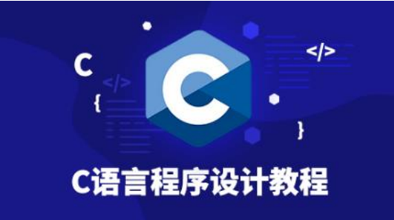
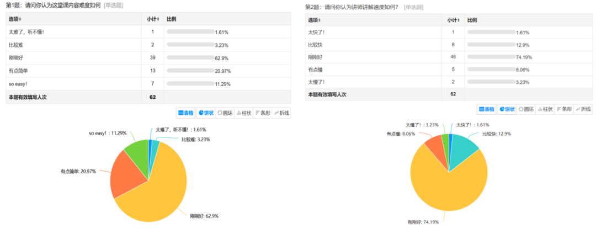
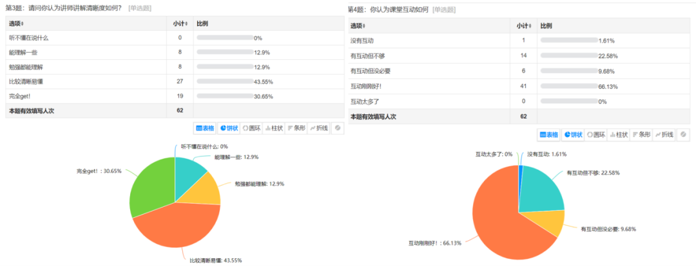
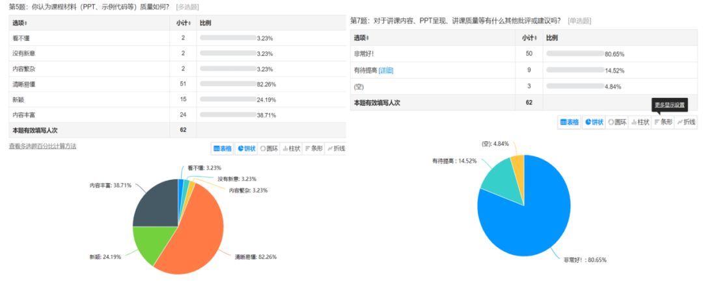

你是否对编程世界充满好奇，却担心零基础的自己难以入门？是否想在大学的第一堂编程课上就自信满满，游刃有余？那么，你绝对不能错过紫冬科协为你精心准备的 **2025 年暑期零基础编程公益培训**！

本次培训由清华大学自动化系学生科协倾情奉献，汇集了众多经验丰富的讲师和优秀学长学姐。他们将以专业的视角、生动的案例，带你走进编程的奇妙世界。本次培训采用 **线上教学模式**，无论你身处何方，都能轻松加入这场编程培训活动！并且该活动面向 2025 年高中毕业、即将升学的同学，**不限于报考清华的同学**。

<!--truncate-->

## 课程大纲

**C 语言**，作为自动化系新生的第一课，也是许多人编程生涯的起点。本课程将深入浅出地讲解 C 语言的基础知识与实战技巧，涵盖**数据类型、运算符、条件分支、循环结构、数组、函数**等核心内容，助你快速入门，在入学后第一学期的编程课上更加从容，为未来的学习打下坚实基础。

### 1. C 语言介绍

在这一章节，我们将从计算机科学的宏大视角出发，了解计算机如何接收、处理信息，进而创造出我们日常所见的数字化奇迹。随后，我们将一同追溯 C 语言的起源，领略它在软件工程、操作系统乃至嵌入式系统中的广泛应用。更重要的是，你将亲手安装并配置 Dev C++ 开发环境，编写并运行你的第一个程序——"Hello, World!"。这不仅标志着你编程之旅的正式开始，也将是你第一次体验到编程带来的成就感。

### 2. 数据类型，变量，常量

我们将详细介绍整型、浮点型、字符型等各种数据类型，以及变量如何承载这些数据。你将学习如何声明和初始化变量，理解它们在内存中的存储方式，以及常量如何在程序中发挥作用，确保代码的稳定性和准确性。

### 3. 运算符，表达式

在这节课中，我们将深入了解算术、比较和逻辑运算符的用法，学习如何构建和解析表达式。通过实战演练，你将亲身体验运算符在解决实际问题时的魔力，进一步加深对编程逻辑的理解。

### 4. 条件分支结构

编程不仅是关于计算，更是关于逻辑和决策。在本节课中，我们将探索 if 语句和 switch-case 语句的奥秘，学习如何让程序根据不同的条件做出响应。通过实例分析，你将掌握条件分支的精髓，学会如何设计算法，使你的代码如同拥有智慧一般，能够根据不同情境作出相应的判断。

### 5. 循环结构

循环结构是程序设计中的重头戏，它能让你的代码高效地处理重复性任务。我们将深入研究 for 循环、while 循环和 do-while 循环的特点与区别，了解它们各自的适用场景。通过实际编码，你将掌握循环控制结构的使用技巧，提升代码的执行效率，让你的程序更加流畅、优雅。

### 6. 数组

数组是存储和操作数据集的强大工具。在这次课程中，你将学会如何声明和初始化数组，理解数组下标的含义。我们还将探索多维数组的奥秘，以及它们在矩阵运算中的应用。通过数组的遍历和排序算法的学习，你将能够更高效地处理数据，提升你的数据处理能力。

### 7. 函数

函数是 C 语言中模块化编程的灵魂。在这最后一课中，我们将学习如何定义和调用函数，理解参数传递的不同方式，以及返回值的使用。你将掌握函数在程序结构中的重要角色，学会如何通过函数封装代码，实现代码的复用，让程序结构更加清晰、易于维护。

## 课程安排

我们精心规划了为期三周的线上暑期培训，课前将发布线上链接，共设 **7 次**精彩授课。在每一讲后会布置一些简单的**小作业**供同学们练手，同时，我们还准备了**课后集中答疑**环节，随时解答疑惑。

活动将于 **8 月 4 日至 8 月 17 日**举行，每两天一次课程，一次约 **1.5 小时**，确保你有足够的时间消化知识。

为了让你更好地掌握所学知识，我们还将**提供丰富的学习资源**，包括每次授课的 PPT、录屏视频以及精选的编程习题和案例。这些资源将**同步上传**至 [Bilibili 清华大学自动化系科协账号 thuasta](https://space.bilibili.com/676450636)，供你随时查阅、巩固基础！

为了鼓励大家积极参与学习、挑战自我，我们还设立了**奖励机制**。培训结束后，我们将根据作业完成情况、课堂表现以及项目实践等多方面因素评选出优秀学员，并为同学们颁发精美礼品。

**让我们携手共进，探索编程的无限可能！**

## 往年课程反馈

去年有**超过 300 名**同学参加了此次零基础编程公益培训，其中约有 **140 名**同学主动加入洛谷团队，巩固自己的程序设计基础。这标志着我们的培训不仅传授了知识，更激发了学员们对编程的浓厚兴趣与持续探索的动力，充分展现了课程跨专业、跨校际的吸引力。

我们在每节讲座后都收集了课程反馈问卷，涵盖了**课程难度、讲解速度、清晰度、互动程度、材料准备**等多维度评价指标，以下是课程评价调研情况：

从反馈数据可以看出，**较高质量的课程设计、清晰易懂的课程讲解**让参与培训的同学们收获颇丰，大部分同学对此次编程培训课程都很满意。学员们在实战中不断挑战自我、突破极限，不仅掌握了编程技能，还培养了解决问题的能力与团队合作精神。许多参与过培训的同学表示，这次经历不仅让他们掌握了编程技能、拓宽了视野和思路，更重要的是激发了他们对编程的热爱和追求。

欢迎大家积极参加此次暑期零基础编程公益培训活动！**[点击链接](https://cloud.tsinghua.edu.cn/d/92d230d9b95c464e978f/)并扫描二维码**加入我们的培训群聊，在这里你将参与丰富的编程实践、遇到志同道合的伙伴并得到讲师的悉心指导。清华大学自动化系科协2025暑期公益编程培训期待你的加入！

---

**
欢迎关注紫冬科协哔哩哔哩官方号**  
**[【THUASTA】](https://space.bilibili.com/676450636)**  
**欢迎关注紫冬科协官方网站**  
**[https://thuasta.org](https://thuasta.org)**  
**获取更多紫冬科创信息~**

编辑 | 谭雯心 石晓玥  
审核 | 张博仕 刘书然
