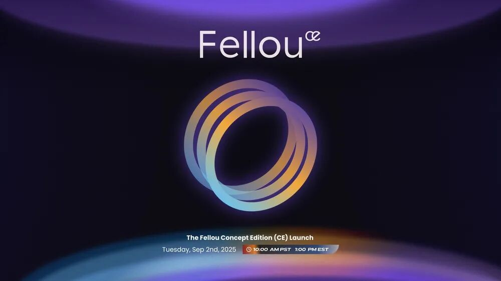

<h2>燎原沙龙</h2>
<strong>行健-无穹-自动化</strong>联合论坛 
——Fellou 校园技术分享会

**“燎原沙龙”** 是由清华大学学生科学技术协会发起，面向全校同学的小型深度学术交流平台。每期邀请不同院系师生，以圆桌讨论、工作坊等互动形式展开，围绕**前沿科技**、**交叉学科**、**科研方法**、**学术规划**与**创新创业**等主题。自启动以来，沙龙已覆盖众多院系，成为清华园内点燃学术星火、助力科研启航的重要力量。

<!-- truncate -->

## 沙龙主讲嘉宾

**主讲嘉宾：**  
**马骁腾**，Fellou 浏览器创始团队成员，算法 & 开源社区负责人，清华大学自动化系博士、博士后，中国人工智能学会智能决策专委会委员。研究方向为深度强化学习，发表 AI 领域论文 30+，谷歌学术引用数 1000+。

## 沙龙主题

### 活动背景

本次 Fellou 校园技术分享会由 **FellouAI 团队**主办，旨在向**校园黑客**和**技术爱好者**介绍前沿的**浏览器技术**及创新的**人机交互探索**。

### 分享内容

- 介绍 Agent 技术的**最新进展**，以及我们**对于人机交互未来的思考**。
- 结合**实际开发经验**，探讨如何让浏览器中的 Agent 技术帮助用户**处理复杂任务**，实现更**自然**、**流畅**的交互体验。
- 分享**未来人机协作**的可能场景，激发同学们的**创新灵感**。

## 受众与期望

我们诚邀有志于**技术创新**与**探索**的同学，尤其是**校园黑客**们加入本次活动。希望通过交流与碰撞，共同探索 **Agent 技术**与**人机交互**的无限可能。

## Fellou 浏览器简介

**企业简介：**  
Fellou 浏览器是由 Fellou AI（ASI X Inc.）团队打造的创新型浏览器产品。

**技术愿景：**  
通过智能化、自动化的浏览体验，推动人机交互进入全新阶段，让浏览器不仅仅是信息窗口，更是高效、智能的个人助理和协作伙伴。

## 活动时间地点

**时间：** 9 月 18 日 下午 14:00–16:00  
**地点：** 填写报名问卷进群后通知

## 报名方式

扫描下方二维码填写报名问卷，并加入活动通知群：

**欢迎来到 Fellou 校园技术分享会**  
**一起见证未来浏览器与智能体的新篇章**

---

文案｜庄子轩  
编辑｜庄子轩  
责编｜常子烁  
审核｜樊傲然 徐辉 张博仕 凌子霄
